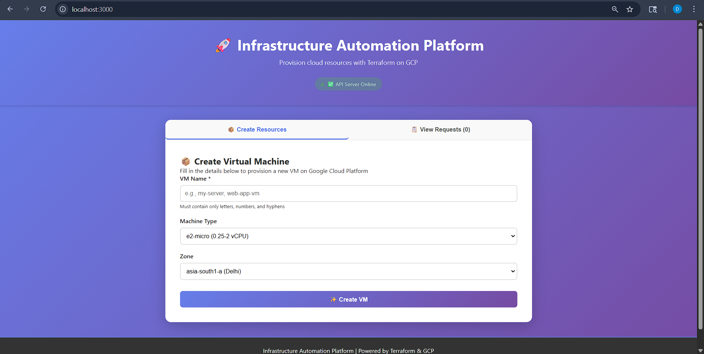
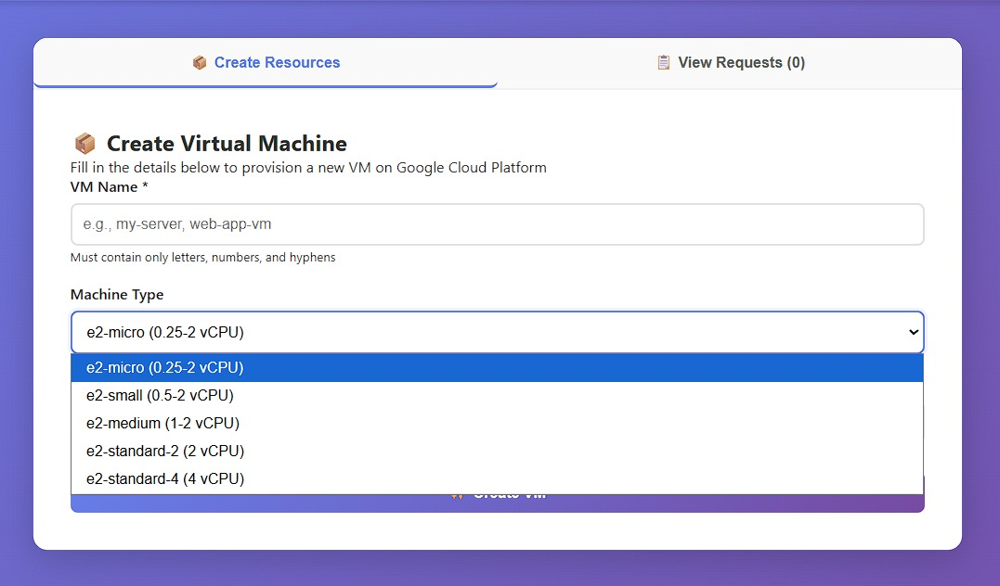
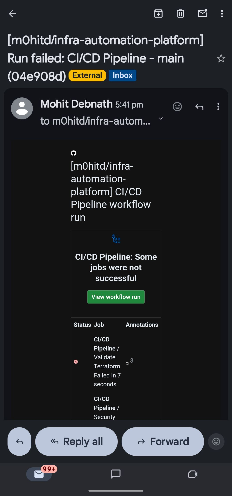

# 🚀 Infrastructure Automation Platform

[](https://github.com)
[](LICENSE)
[](https://www.terraform.io/)
[](https://cloud.google.com/)

A **production-ready Infrastructure Automation Platform** that enables API-driven provisioning of cloud resources using **Terraform** on **Google Cloud Platform (GCP)**.

## 📋 Overview

This platform demonstrates enterprise-level cloud infrastructure automation that combines:
- **Infrastructure as Code (IaC)** with Terraform
- **REST API Backend** for resource provisioning
- **Modern React UI** for easy interaction
- **Security-first design** with GCP best practices
- **Scalable architecture** ready for production

### Key Features

✅ **API-Driven Infrastructure Provisioning**
- Create virtual machines dynamically via REST API
- Support for multiple machine types and configurations
- Request tracking and history

✅ **Modular Terraform Architecture**
- Reusable modules (compute, network, storage)
- Environment-specific configurations (dev/prod)
- Infrastructure version control with Git

✅ **Professional Dashboard UI**
- Intuitive form for resource creation
- Real-time API status monitoring
- Request history and statistics
- Responsive design for all devices

✅ **Production-Grade Code**
- Comprehensive error handling
- Security-first design patterns
- Detailed logging and monitoring
- CI/CD ready deployment pipeline

✅ **Scalable Backend**
- Cloud Run compatible
- Stateless API architecture
- Horizontal scaling support

## 🏗️ Architecture

```
┌─────────────────────────────────────────┐
│      React Frontend (Dashboard)         │
│  • VM Creation Form                    │
│  • Real-time Status Monitoring         │
│  • Request History & Statistics        │
└────────────────────┬────────────────────┘
                     │
              HTTP (REST API)
                     │
┌────────────────────▼────────────────────┐
│    Node.js Express Backend API          │
│  • Request Processing                  │
│  • Input Validation                    │
│  • Terraform Orchestration             │
└────────────────────┬────────────────────┘
                     │
            Terraform CLI Commands
                     │
┌────────────────────▼────────────────────┐
│   Terraform Infrastructure as Code      │
│  • Modular resource definitions        │
│  • Environment configurations          │
│  • State management                    │
└────────────────────┬────────────────────┘
                     │
            Google Cloud APIs
                     │
┌────────────────────▼────────────────────┐
│   Google Cloud Platform (GCP)           │
│  • Compute Engine                      │
│  • Cloud Storage                       │
│  • VPC & Networking                    │
│  • IAM & Security                      │
└─────────────────────────────────────────┘
```

For detailed architecture, see [docs/architecture.md](docs/architecture.md)

## 🚀 Quick Start

### Prerequisites

- **Node.js 16+** - For backend and frontend
- **Terraform 1.0+** - Infrastructure provisioning
- **Google Cloud Account** - With GCP project and billing enabled
- **Git** - Version control

### Installation

1. **Clone the repository**
```bash
git clone https://github.com/yourusername/infra-automation-platform.git
cd infra-automation-platform
```

2. **Setup Backend API**
```bash
cd backend
npm install
cp .env.example .env
# Configure your GCP project ID in .env
npm start
```

The backend will run on `http://localhost:3000`

3. **Setup Frontend (in a new terminal)**
```bash
cd frontend
npm install
npm start
```

The frontend will open at `http://localhost:3000` (React app)

4. **Setup Terraform (in another terminal)**
```bash
cd terraform
terraform init
terraform plan -var-file="environments/dev/terraform.tfvars"
```

## 📸 Screenshots

### Dashboard Home

*Modern, intuitive dashboard for infrastructure management*

### VM Creation Form

*Simple form to provision new virtual machines*

### VM Zones

*Real-time zones of infrastructure provisioning*

<<<<<<< HEAD
### CI/CD Email Notification

*Automated email confirmation of deployment pipeline execution*

=======
### CI/CD Email Alert

>>>>>>> daa7270cabe9d538241b66a3b212b616276b26e5
## 📚 API Endpoints

### Health Check
```bash
GET /health
```
Check if the API is running
```json
{
  "status": "OK",
  "message": "Infrastructure Automation Platform API is running",
  "timestamp": "2024-03-08T10:30:45.123Z"
}
```

### Create Virtual Machine
```bash
POST /create-vm
Content-Type: application/json

{
  "vmName": "web-server-01",
  "machineType": "e2-micro",
  "zone": "asia-south1-a"
}
```

### Get All Requests
```bash
GET /requests
```

### View System Logs
```bash
GET /logs
```

### Destroy Infrastructure
```bash
POST /destroy-infrastructure
Content-Type: application/json

{
  "vmName": "web-server-01"
}
```

## 📁 Project Structure

```
infra-automation-platform/
│
├── frontend/                  # React.js Dashboard
│   ├── public/
│   ├── src/
│   │   ├── components/       # React Components
│   │   ├── App.js           # Main Application
│   │   └── App.css          # Styling
│   └── package.json
│
├── backend/                   # Node.js API Server
│   ├── services/             # Terraform Execution Logic
│   ├── app.js               # Express Application
│   └── package.json
│
├── terraform/                 # Infrastructure as Code
│   ├── modules/
│   │   ├── compute/         # VM Provisioning
│   │   ├── network/         # VPC Configuration
│   │   └── storage/         # Storage Buckets
│   ├── environments/        # Dev/Prod Configs
│   ├── main.tf
│   ├── variables.tf
│   └── outputs.tf
│
├── docs/                      # Documentation
│   ├── architecture.md       # System Architecture
│   ├── methodology.md        # Development Approach
│   ├── workflow.md           # User Workflows
│   └── security.md           # Security Best Practices
│
├── .github/
│   └── workflows/            # CI/CD Pipelines
│
├── README.md                  # This file
└── .gitignore               # Git ignore rules
```

## 🔧 Configuration

### Backend Configuration

Create `backend/.env`:
```env
PORT=3000
NODE_ENV=development
GCP_PROJECT_ID=your-gcp-project-id
TERRAFORM_PATH=../terraform
```

### Terraform Configuration

Edit `terraform/environments/dev/terraform.tfvars`:
```hcl
project_id   = "your-gcp-project-id"
region       = "asia-south1"
environment  = "dev"
instance_name = "dev-vm"
machine_type = "e2-micro"
```

## 🔐 Security

### Key Security Features

✅ **No Hardcoded Credentials**
- All secrets via environment variables
- Service account authentication

✅ **Input Validation**
- All API inputs validated
- Terraform variable constraints

✅ **Network Security**
- VPC for resource isolation
- Firewall rules with least privilege
- HTTPS for all communications

✅ **Audit Logging**
- All operations logged
- Terraform state versioning
- Request tracking

✅ **Least Privilege Access**
- Minimal IAM roles
- Service account separation

For detailed security documentation, see [docs/security.md](docs/security.md)

## 🔄 Workflow

### User Request Flow

1. **User** navigates to dashboard and fills VM creation form
2. **Frontend** validates input and sends HTTP request to backend
3. **Backend** processes request and executes Terraform commands
4. **Terraform** provisions resources on Google Cloud Platform
5. **Database** stores request status and logs
6. **Frontend** displays real-time status and updates request history

Detailed workflow: [docs/workflow.md](docs/workflow.md)

## 🏭 Deployment

### Deploy Backend to Cloud Run

```bash
cd backend
gcloud run deploy infra-api \
  --source . \
  --region asia-south1 \
  --allow-unauthenticated
```

### Deploy Frontend

```bash
cd frontend
npm run build
# Deploy build/ folder to Cloud Storage or Firebase Hosting
gsutil -m cp -r build/* gs://your-bucket/
```

### Cloud Infrastructure Setup

```bash
# Create GCS bucket for Terraform state
gsutil mb gs://unique-tf-state-bucket

# Enable required APIs
gcloud services enable compute.googleapis.com
gcloud services enable cloudbuild.googleapis.com
gcloud services enable run.googleapis.com
```

## 📊 Monitoring

### View Logs

**Backend Logs**:
```bash
gcloud logging read "resource.type=cloud_run_revision" \
  --limit 50 \
  --format json
```

**Terraform Logs**:
```bash
terraform show
terraform state list
```

## 🧪 Testing

### Manual Testing

```bash
# Test API health
curl http://localhost:3000/health

# Test VM creation
curl -X POST http://localhost:3000/create-vm \
  -H "Content-Type: application/json" \
  -d '{
    "vmName": "test-vm",
    "machineType": "e2-micro",
    "zone": "asia-south1-a"
  }'

# View requests
curl http://localhost:3000/requests
```

### Terraform Testing

```bash
cd terraform
terraform fmt          # Format code
terraform validate     # Validate configuration
terraform plan        # Show what will change
```

## 📈 Future Enhancements

- [ ] **Multi-Cloud Support**: AWS and Azure providers
- [ ] **Database Management**: Automated DB provisioning
- [ ] **Advanced Networking**: VPN and interconnect setup
- [ ] **Cost Analytics**: Real-time cost tracking
- [ ] **Role-Based Access Control**: User permission management
- [ ] **Monitoring Dashboard**: Infrastructure health visualization
- [ ] **CI/CD Pipeline**: Automated testing and deployment
- [ ] **Policy as Code**: OPA/Sentinel for governance

## 💡 Design Decisions

### Why Terraform?
- **Declarative IaC**: Clear infrastructure definition
- **Multi-cloud**: Can extend to AWS/Azure
- **Community**: Large ecosystem and support
- **Modularity**: Reusable components

### Why API-Driven?
- **Decoupled Architecture**: Frontend/Infrastructure independent
- **Automation Ready**: Easy CI/CD integration
- **Scalability**: Handles concurrent requests
- **Auditability**: All operations logged

### Why Modular Structure?
- **Maintainability**: Changes localized
- **Reusability**: Share modules across projects
- **Testing**: Test modules independently
- **Scaling**: Easy to add new resources

## 📚 Documentation

- [Architecture Overview](docs/architecture.md) - System design and components
- [Methodology](docs/methodology.md) - Development approach and best practices
- [Workflow Documentation](docs/workflow.md) - User interactions and data flow
- [Security Guide](docs/security.md) - Security implementation and checklist

## ⚙️ Technologies Used

| Component | Technology | Purpose |
|-----------|-----------|---------|
| Frontend | React 18 | User Interface |
| Backend | Node.js + Express | REST API |
| IaC | Terraform 1.0+ | Infrastructure Code |
| Cloud | Google Cloud Platform | Cloud Provider |
| Database | Firestore (Optional) | Request Storage |
| Deployment | Cloud Run | Serverless Backend |
| Versioning | Git | Code Management |

## 🤝 Contributing

Contributions are welcome! Please:

1. Fork the repository
2. Create a feature branch (`git checkout -b feature/amazing-feature`)
3. Commit changes (`git commit -m 'Add amazing feature'`)
4. Push to branch (`git push origin feature/amazing-feature`)
5. Open a Pull Request

## 📄 License

This project is licensed under the MIT License - see [LICENSE](LICENSE) file for details.

## 👤 Author

**Your Name**
- GitHub: [@m0hitd](https://github.com/m0hitd)
- LinkedIn: [m0hitdebnath](https://www.linkedin.com/in/m0hitdebnath/)

## 🎯 Resume Impact

This project demonstrates:

✅ **Cloud Engineering Skills**
- GCP expertise and best practices
- Terraform Infrastructure as Code
- Multi-tier architecture design

✅ **DevOps Capabilities**
- CI/CD pipeline understanding
- Infrastructure automation
- Deployment and scaling

✅ **Software Engineering**
- Full-stack development (frontend + backend)
- REST API design
- Modular code structure

✅ **Production Readiness**
- Security-first design
- Error handling and validation
- Comprehensive documentation
- Scalable architecture

## 🔗 Quick Links

- [API Documentation](docs/api.md)
- [Deployment Guide](docs/deployment.md)
- [Troubleshooting](docs/troubleshooting.md)
- [GitHub Issues](https://github.com/m0hitd/infra-automation-platform/issues)

## ⭐ Show Your Support

If you found this project helpful, please consider giving it a star! It helps others discover the project.

---

**Last Updated**: March 2026
**Status**: Production Ready ✅\ The deployment pipeline is fully ready. I’ve validated everything locally including Terraform execution and API integration. I’m currently waiting for billing activation to run it on GCP.
